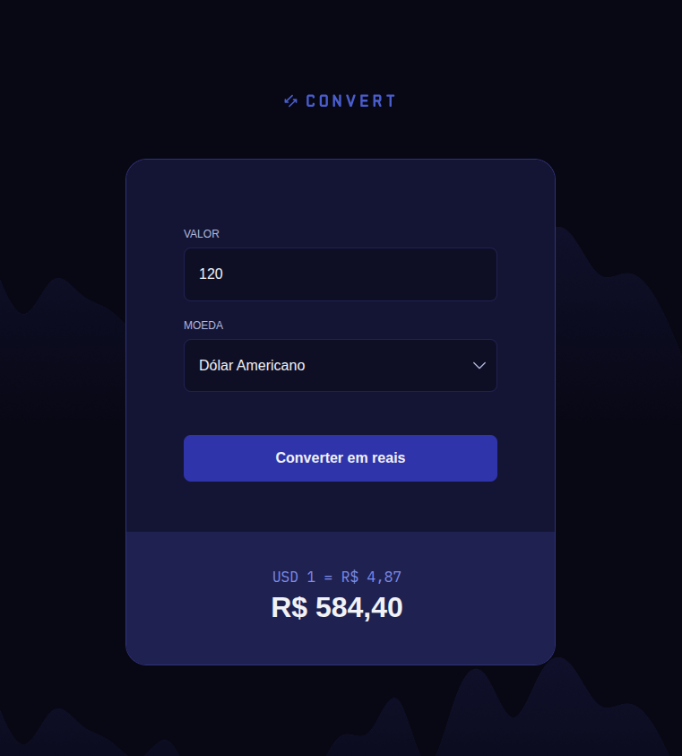

# Convert


## 💼 Contexto de Negócio

**Convert** é uma aplicação que converte valores na moeda Dolar Americano, Euro e Libra Esterlina em Real Brasileiro.


## 💻 Layout



## 🔧 Linguagens
 - HTML
 - CSS
 - JS

## 🤖 Clonar repositório

1. Clone o repositório:
```bash
  git clone https://github.com/CaioAlves10/fullstack-nivel-06-convert.git
```

2. Entre no diretório:
```bash
  cd fullstack-nivel-06-convert
```

<br />

---

<br />

<p align="center">
  Feito com 💙 por Caio Carvalho
</p>